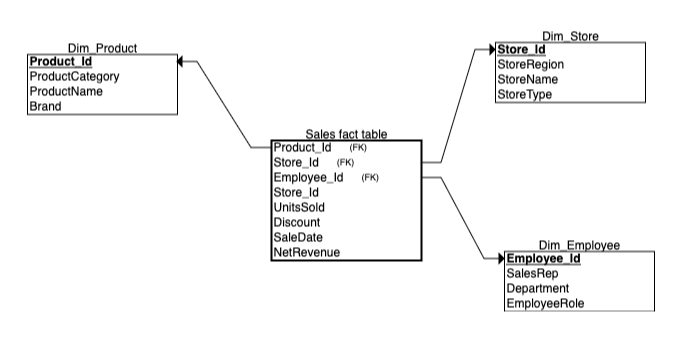
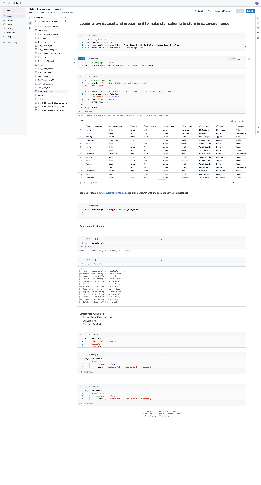
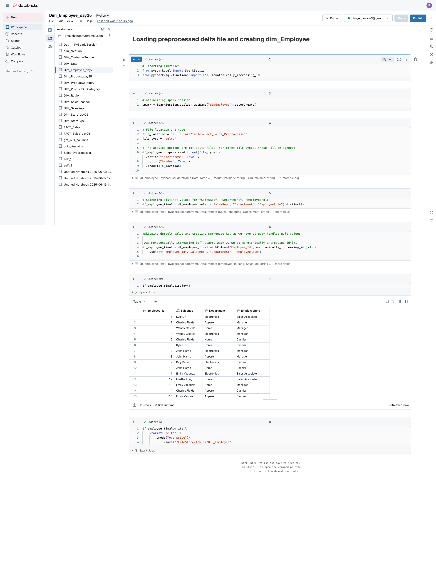
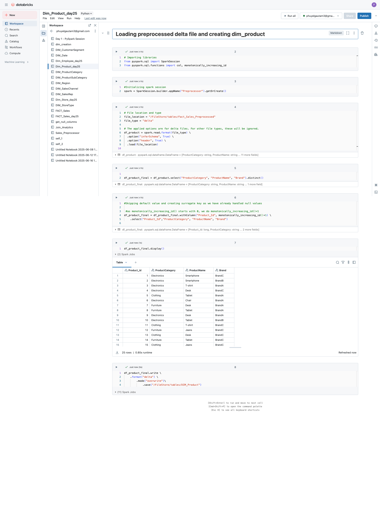
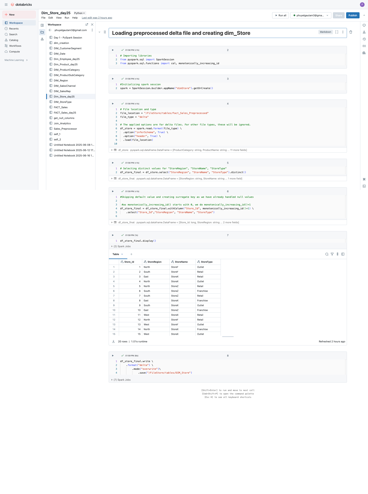
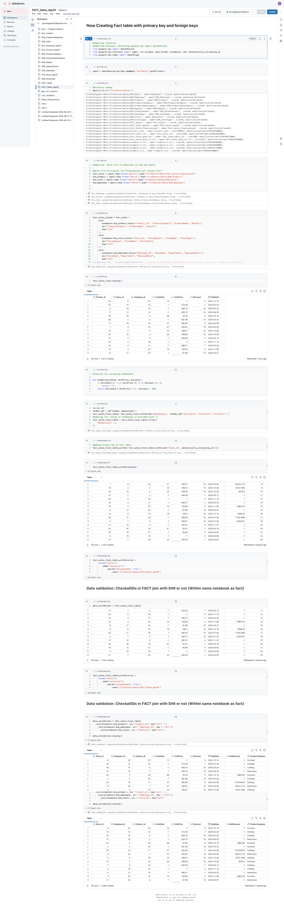

## 1. Entity-Relationship Diagram (ERD)

---

## 2. Data Quality and Preprocessing

  
*Function to return null columns*

  
*Cleaned data before converting to warehouse*

---

## 3. Dimensions

  
*Employee dimension table*

  
*Product dimension table*

  
*Store dimension table*

---

## 4. Fact Table

  
*Sales fact table representing transactional data*
